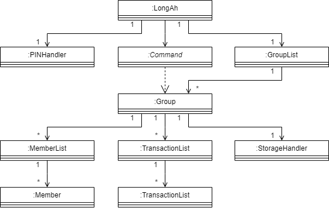
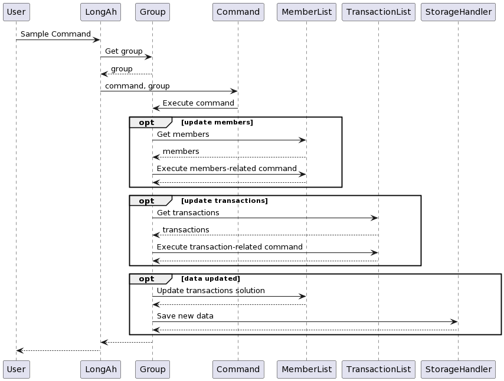
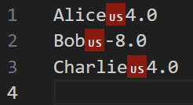
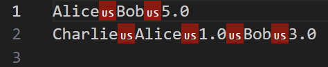
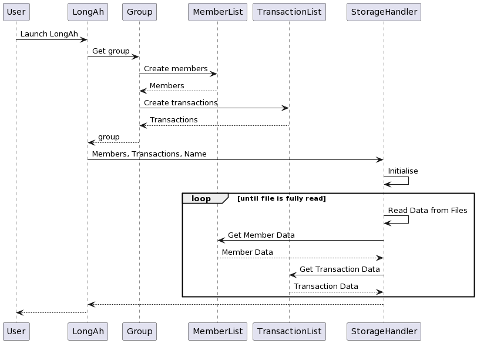
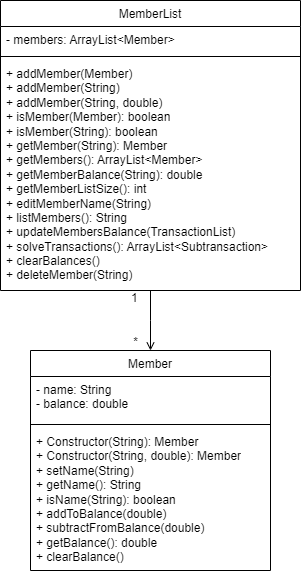

# Developer Guide

## Table of Contents
- [Developer Guide](#developer-guide)
  - [Table of Contents](#table-of-contents)
  - [Acknowledgements](#acknowledgements)
  - [Design \& Implementation](#design--implementation)
    - [UI and I/O](#ui-and-io)
    - [Commands](#commands)
    - [Storage](#storage)
    - [Group and GroupList](#group-and-grouplist)
    - [Member and MemberList](#member-and-memberlist)
    - [Transaction and TransactionList](#transaction-and-transactionlist)
    - [PIN](#pin)
    - [Chart](#chart)
    - [Exceptions and Logging](#exceptions-and-logging)
  - [Product scope](#product-scope)
    - [Target user profile](#target-user-profile)
    - [Value proposition](#value-proposition)
  - [User Stories](#user-stories)
  - [Non-Functional Requirements](#non-functional-requirements)
  - [Glossary](#glossary)
  - [Instructions for Testing](#instructions-for-testing)
    - [Manual Testing](#manual-testing)
    - [JUnit Testing](#junit-testing)
    - [Text UI Testing](#text-ui-testing)
  - [Future Enhancements](#future-enhancements)

## Acknowledgements

LongAh uses the following libraries:

1. [XChart](https://knowm.org/open-source/xchart/) - Used for generating charts to visualize data.

LongAh uses the following tools for development:

1. [JUnit 5](https://junit.org/junit5/) - Used for testing.
2. [Gradle](https://gradle.org/) - Used for build automation.


## Design & Implementation

The UML diagram below provides an overview of the classes and their interactions within the LongAh application.



The high-level overview of the application is provided in the flowchart below as well.


Design and Implementation has been broken down into the subsequent sections, each tagged for ease of reference:

* [UI and I/O](#ui-and-io)
* [Commands](#commands)
* [Storage](#storage)
* [Group and GroupList](#group-and-grouplist)
* [Member and MemberList](#member-and-memberlist)
* [Transaction and TransactionList](#transaction-and-transactionlist)
* [PIN](#pin)
* [Chart](#chart)
* [Exceptions and Logging](#exceptions-and-logging)

### UI and I/O

<ins>Overview</ins>

The UI and I/O functionalities act as the interface between the user and the application. They are managed by the `UI` and `InputHandler` classes, respectively, with `UI` handling displaying messages to the user and reading user input, while `InputHandler` is responsible for parsing user input and returning the corresponding `Command` object.

<ins>Class Structure</ins>

The UI class has the following static attributes:

* *SEPARATOR*: A constant string representing a straight line to be printed to the console.
* *scanner*: A `Scanner` object used for reading from `System.in` I/O.

The InputHandler class itself does not have any attributes.

<ins>Methods</ins>

The UI class has the following key methods:

* *getUserInput*: Reads the user input from the console and returns it as a String.
* *showMessage*: Displays the provided message to the user. This is overloaded to take either a String or a String and a boolean. The latter is used to define whether a newline should be printed at the end of the String. Newline is printed by default. 

The InputHandler class has the following key method:

* *paseInput*: Parses the user input and returns the corresponding `Command` object.

<ins>Design Considerations</ins>

* UI class is used as part of exception handling for displaying of error messages to the user for feedback.

### Commands

<ins>Overview</ins>

The abstract `Command` class has been implemented to introduce an additional layer of abstraction between I/O and command execution, allowing for separation of handling command keywords and executing commands.

The `Command` class has been subdivided into further packages for similar commands, such as `AddCommand` and `EditCommand`. There are other niche children classes that have not been aggregated into a package as well.

<ins>Implementation Details</ins>

The following diagram is a inheritance diagram for `Command` and its children classes. This has been heavily simplified and only shows the key commands.


The following diagram is a sequence diagram for execution of `Command`.



<ins>Class Structure</ins>

The abstract `Command` class and its related children classes have the following attributes:

* *CommandString*: String indicating the command being parsed.
* *TaskExpression*: String containing details for the command to effect.

<ins>Constructor</ins>

The Command constructor updates the attributes based on the input arguments.

<ins>Methods</ins>

The abstract `Command` class and its related children classes have the following method:
* *execute*: Effect the command based on the `CommandString` and the `TaskExpression`.

### Storage

<ins>Overview</ins>

The `StorageHandler` class is responsible for managing the loading and saving of data regarding members and transactions from and onto the local machine. Each `Group` calls its own `StorageHandler` object such that they maintain distinct storage directories.

<ins>Implementation Details</ins>

Each `StorageHandler` instance creates `members.txt` and `transactions.txt` in their respective subdirectories based on the name of the `Group`. The file formats are as follows, with samples provided.

* `members.txt`

```
NAME | BALANCE
```



* `transactions.txt`
  
```
LENDER NAME | TRANSACTION TIME(if applicable) | BORROWER1 NAME | AMOUNT1 | BORROWER2 NAME...
```



The following diagram is a sequence diagram of the initialisation of `StorageHandler`. Here, it reads data from the 2 data storage files and creates `Member` and `Transaction` objects in the associated utility list objects.



<ins>Class Structure</ins>

The StorageHandler has the following attributes:

* *storageFolderPath*: A string containing the path to the storage directory specific to the group.
* *storageMembersFilePath*: A string containing the path to the `members.txt` directory associated with the group.
* *storageTransactionsFilePath*: A string containing the path to the `transactions.txt` directory associated with the group.
* *membersFile*: A File object representing the `members.txt` file associated with the group.
* *transactionsFile*: A File object representing the `transactions.txt` file associated with the group.
* *members*: A MemberList object representing the list of Members in the group.
* *transactions*: A TransactionList object representing the list of Transactions in the group.
* *scanners*: A size 2 array of Scanners to be used for loading data from the data storage files. The first Scanner in the array is used for reading from `members.txt` while the second is used for reading from `transactions.txt`.

<ins>Constructor</ins>

The StorageHandler constructor creates the relevant data storage directories if they do not current exist while initializing the attributes of the object.

Key arguments for the constructor are a `MemberList` object, a `TransactionList` object and a string `groupName`. The first two are used to represent the list of `Member` objects and the list of `Transaction` objects associated with the group for reference when loading or saving data. The last represents the directory to be written to to ensure that data across groups are kept discrete.

<ins>Methods</ins>

* *loadMembersData*: Reads data from `membersFile` and unpacks it before inserting `Member` objects into `MemberList`.
* *loadTransactionsData*: Reads data from `transactionsFile` and unpacks it, checking if each member exists in `MemberList` before inserting `Transaction` objects into `TransactionList`.
* *saveMembersData*: Writes packaged data from each `Member` and saves it as a record in `membersFile`.
* *saveTransactionsData*: Writes packaged data from each `Transaction` and saves it as a record in `transactionsFile`.
  
Data loading methods are merged in the *loadAllData* method while data saving methods are merged in the *saveAllData* method.

<ins>Usage Example</ins>

The following code segment outlines the use of `StorageHandler`.

```
import longah.util.MemberList;
import longah.util.TransactionList;

// Initialization and loading from storage
MemberList members = new MemberList();
TransactionList transactions = new TransactionList();
String name = "foo";
StorageHandler storage = new StorageHandler(members, transactions, name);

/*
At this point a subdirectory "foo" will be created if it did not previously exist
Data is loaded from "foo" to members and transactions
Assume functions modifying members and transactions are called following that.
*/

// Writing to storage
storage.saveAllData();
```

<ins>Design Considerations</ins>

* Update upon change, not upon exit - This allows for data to be saved even if the application exits ungracefully.
* *checkTransactions* - Methods are provided to have a quick check to ensure that data from data storage is not corrupted.

### Group and GroupList

<ins>Overview</ins>

<ins>Implementation Details</ins>

<ins>Class Structure</ins>

<ins>Constructor</ins>

<ins>Methods</ins>

<ins>Usage Example</ins>

<ins>Design Considerations</ins>

### Member and MemberList

<ins>Overview</ins>

The `Member` class is used to represent a discrete person object, while the `MemberList` class is used to represent the aggregation members within a group.

<ins>Class Structure</ins>

The `Member` class has the following attributes.

* *name*: A string representing the name of a person within the group. Used for visual identification of each member. Name of the member is strictly alphanumeric and cannot include special characters including the blank character.
* *balance*: A double representing the amount loaned/owed by the member. A positive value indicates that the member is owed money while a negative value indicates that the member owes money.

The `MemberList` class has the following attribute.

* *members*: An array list collection of Member objects.

<ins>Implementation Details</ins>

The detailed class diagram for `Member` and `MemberList` can be found below.



<ins>Constructor</ins>

The Member constructor creates a member object and initialises the current balance of the member, either to 0 or to a specified value. The latter is largely only used as part of storage methods. Checking for validity of the name is performed here.

Key arguments of the Member constructor are a string `name` and optionally a double `balance`.

The MemberList constructor initializes an empty array list of members for newly created members to be added to.

<ins>Methods</ins>

The Member class has the following key methods.

* *setName*: Updates the name of a member. Used when edit member command is invoked.
* *addToBalance*: Adds the value of a transaction to a member. Absolute values are used to reduce complexity of balance update method calls for both the loaner and the borrower.
* *subtractFromBalance*: Subtracts the value of a transaction from a member. Absolute values are used to reduce complexity of balance update method calls for both the loaner and the borrower.
* *clearBalance*: Resets the current balance of a member to zero. Used then the clear command is invoked.

The MemberList class has the following key methods.

* *addMember*: Adds a member object to the current array list of members. This method is overloaded to allow for appending an exisiting member object or appending a newly created member object.
* *isMember*: Checks if a member object is already a part of the current array list of members.
* *getMember*: Returns the member object representation given the name of a member.
* *editMemberName*: Updates the name of an existing member based on their current name.
* *listMembers*: Returns a string representation of the current array list of members.
* *updateMembersBalance*: Updates the current balance of all members in the group based on a passed in `TransactionList` object.
* *solveTransactions*: Returns an array list of `Subtransaction` representing the least transactions solution to solving all debts in the group.
* *deleteMember*: Removes a member from the current array list of members.

<ins>Usage Example</ins>

The following code segment outlines a sample use of `Member`.

```
import longah.node.Member;
import longah.handler.UI;

// Init member with balance of 0
String name = "foo";
Member member1 = new Member(name);

// Init member with balance of 5
String name = "bar";
double balance = 5;
Member member2 = new Member(name, balance);

// Updating member balance
member1.addToBalance(5);
member2.subtractFromBalance(1.30);
member1.clearBalance();

// Print string representation of member
UI.showMessage(member1); // Using our UI methods is preferred over System.out calls
```

The following code segment outlines a sample use of `MemberList`.

```
import longah.util.MemberList

MemberList members = new MemberList();
members.addMember("Alice");
members.editMemberName("Alice", "Bob");
members.updateMembersBalance(transactions); // Assuming we have a pre-defined TransactionList object
ArrayList<Subtransaction> solution = members.solveTransactions();
members.clearBalances();
members.delete("Bob");
```

<ins>Design Considerations</ins>

The Member class takes the following into consideration.

* The class ensures that member names are alphanumeric and does not allow for special characters including blank space.
* This method is used in conjunction with a `TransactionList` obejct as part of a `Group`.

The MemberList class takes the following into consideration.

* `updateMembersBalance` clears current balances at the start of invokation. This removes any transactions that are not captured within the `TransactionList` object passed into the method.

### Transaction and TransactionList
<ins>Transaction Overview</ins>

The Transaction class is responsible for representing a single transaction in the LongAh application between 2 members.
It contains information about the lender, borrowers, and the amount involved in the transaction.


<ins>Class Fields</ins>
* lender: Represents the member who lent the money.
* transaction time (optional): Represents the time at which the transaction took place.
* subtransactions: An ArrayList of Subtransaction objects, representing individual borrowings within the transaction.

<ins>Transaction Constructor</ins>

`Transaction(String userInput, MemberList members)`
* Parses the given user input and creates a new Transaction object with the specified lender, borrowers, and amount.
* Called whenever a new transaction is added to the transaction list.

`Transaction(Member lender, ArrayList<Subtransaction> subtransactions,
MemberList members)`
* Constructs a transaction instance using specified lender, subtransactions, member list.
* This constructor is used for storage methods only.

`Transaction(Member lender, ArrayList<Subtransaction> subtransactions,
MemberList members, String transactionTime)`
* Constructs a transaction instance using specified lender, subtransactions, member list and transaction time.
* This constructor is used for storage methods only on entries with transaction time.

<ins>Transaction Methods</ins>

- *parseTransaction*: Parses the user input to extract lender and borrowers, then adds them to the transaction.

- *addBorrower*: Adds a borrower to the transaction.

- *getLender*: Returns the lender of the transaction.

- *isLender*: Checks if a given member is the lender of the transaction.

- *isborrower*: Checks if a given member is a borrower in the transaction.

- *isInvolved*: Checks if a given member is involved in the transaction.

- *toStorageString*: Converts the transaction to a string format for storage.

- *getSubtransactions*: Returns the list of subtransactions in the transaction.

- *editTransaction*: Edits the transaction based on new user input.

- *deleteMember*: Deletes a member from the transaction and returns true if transaction needs to be removed.

- *haveTime*: Checks if a given transaction has a corresponding time component.


<ins>TransactionList Overview</ins>

The TransactionList class is responsible for managing a list of transactions in the LongAh application. It provides methods to add, delete, and retrieve transactions from the list.

<ins>Class Fields</ins>

- *transactions*: An ArrayList of Transaction objects representing the list of transactions in LongAh!.

<ins>TransactionList Methods</ins>

- *addTransaction*: Parses user input and adds a new transaction to the list.

- *getTransactionListSize*: Returns the size of the transaction list.

- *remove*: Removes a transaction from the list based on the index.

- *clear*: Clears all transactions from the list.

- *getTransaction*: Returns the list of transactions.

- *listTransactions*: Lists all transactions in the transaction list.

- *findLender*: Finds all transaction where a specified member is the lender.

- *findBorrower*: Finds all transaction where a specified member is a borrower.

- *findTransactions*: Finds a transaction based on member name.

- *editTransactionList*: Edits a transaction in the list based on user input.

- *findDebts*: Finds all debts owed by a specified member.

- *deleteMember*: Deletes a member from all transactions in the list.

<ins>Usage Example</ins>

Adding a new transaction:


Given below is an example usage scenario and how the Transaction class behaves at each step:


1. The user enters a new transaction using the 'add transaction' command with the lender, borrower(s), amount(s) and time specified.
2. The TransactionList class takes in the user input and creates a new Transaction object with the specified details for the specified memberList.
3. The Transaction class parses the user input to extract the lender and borrower(s) and adds them to the transaction.
4. The Transaction object is added to the TransactionList, which stores the list of transactions.
5. The Logger class logs the new transaction for information tracking, and logs a warning if an invalid transaction format is entered.
6. The Group class then updates the best transaction settlement solution and member balances based on the new transaction.
7. The StorageHandler class saves the updated data to the relevant files for future reference.

Code Snippet
```
MemberList members = group.getMemberList();
TransactionList transactions = group.getTransactionList();
transactions.addTransaction(taskExpression, members);
group.updateTransactionSolution();
group.saveAllData();
```
<ins>Conclusion</ins>

The Transaction class provides functionality for managing transactions between
facilitates the lending of money and ensures data integrity by validating input and managing member interactions.

The TransactionList class provides essential functionalities for managing a list of transactions.
Its methods facilitate the addition, removal, editing, and retrieval of transactions, ensuring efficient management of transactions within a group.

### PIN

<ins> Overview </ins>

The PINHandler class is responsible for managing the creation, loading, authentication, and resetting of a
Personal Identification Number (PIN) used for authentication in the LongAh application. It uses SHA-256 hashing to
securely store and compare PINs. The PINHandler class interacts with the StorageHandler class to save and load the PIN
and authentication status.

Note: PIN is disabled by default and needs to be set upon first startup.

<ins>Implementation Details </ins>

*Data Storage:*

The PIN and authentication enabled status are saved in a file located at ./data/pin.txt.
The file format is as follows:

`hashed PIN`<br />
`authenticationEnabled`<br />

<ins> Class Structure </ins>

The PINHandler class has the following static fields:


- *PIN_FILE_PATH*: The path to the file where the PIN and authentication status are saved.

- *savedPin*: The hashed PIN saved in the file.

- *authenticationEnabled*: A boolean flag indicating whether authentication is enabled.

<ins> Constructor </ins>

The PINHandler constructor initializes the savedPin and authenticationEnabled fields by loading them from the file using
the loadPinAndAuthenticationEnabled method.

If the file does not exist or the savedPin is empty, it calls the createPin method to create a new PIN.

<ins> Methods </ins>

- *loadPinAndAuthenticationEnabled*: Loads the saved PIN and authentication enabled status from the file.

- *savePinAndAuthenticationEnabled*: Saves the PIN and authentication enabled status to the file.

- *getPinFilePath*: Returns the file path of the PIN file.

- *createPin*: Prompts the user to create a new 6-digit PIN and hashes it before saving.

- *authenticate*: Authenticates the user by comparing the entered PIN with the saved PIN.

- *resetPin*: Resets the PIN for the user by prompting for the current PIN and creating a new PIN if the current
PIN is correct.

- *enablePin*: Enables authentication upon startup.

- *disablePin*: Disables authentication upon startup.

- *getSavedPin*: Returns the saved PIN.

- *getAuthenticationStatus*: Returns the authentication status.

<ins> Usage Example </ins>

The following diagram illustrates the sequence during PIN authentication.


This diagram shows the sequence when the user resets their PIN.


Given below is an example usage scenario and how the PIN creation and authentication mechanism behaves at each step:

1. The user launches the application for the first time. The PINHandler initializes, loading the saved PIN and 
authentication enabled status from the file. If no PIN exists, it prompts the user to create a new PIN.

2. The user creates a new 6-digit PIN using the createPin method. The entered PIN is hashed using SHA-256 before 
saving it to the file.

3. The user enables authentication upon startup using the 'pin enable' command. The authenticationEnabled flag is set to True and saved to the file.

4. The user closes the application and relaunches it. The PINHandler loads the saved PIN and authentication 
enabled status from the file again.

5. The user attempts to log in by entering their PIN. The authenticate method hashes the entered PIN and 
compares it with the saved hashed PIN. If they match, the user is successfully authenticated. Otherwise, the user is denied access.

6. The user decides to reset their PIN by entering their current PIN and creating a new one using the resetPin 
method.

7. The user disables authentication upon startup using the 'pin disable' command. The authenticationEnabled flag 
is set to false and saved to the file.

8. The user relaunches the application, and authentication is no longer required since it has been disabled. 
The user can proceed with the application and do any actions without entering a PIN.

Code Snippet
```
// Initialize PINHandler
PINHandler pinHandler = new PINHandler();

// Check if authentication is enabled
if (PINHandler.getAuthenticationStatus()) {
// Authenticate user
PINHandler.authenticate();
} else {
// Authentication is disabled, proceed with application logic
}
```

<ins> Design Considerations </ins>

Resetting PIN: The resetPin() method allows users to change their PIN by first verifying their current PIN. This adds
an extra layer of security to prevent unauthorized PIN changes.

Authentication Management: Users have the option to enable or disable authentication upon startup using the 'pin enable'
and 'pin disable' commands. This flexibility allows users to customize their authentication preferences based on their
security needs and convenience.

### Chart

<ins>Overview</ins>

The Chart class is responsible for generating a visual representation of the transaction solution in the form of a chart.

The chart is displayed in a separate window and shows the individual balances among the group members.

This is handled using a package called 'XChart'.

It provides a convenient way to visualize data, particularly for member balances in the LongAh application. The bar chart generated by this class showcases positive and negative balances of members, offering insights into financial statuses.

<ins>Implementation Details</ins>

Data Representation: 

The Chart class utilizes the XChart library to represent data in the form of bar charts. It distinguishes positive and negative balances by differentiating them with green and red colors, respectively.


<ins>Class Structure</ins>

The Chart class consists of the following components:

- *Constructor*: Instantiates a new Chart object by displaying the provided category chart.

- *Static Method*: viewBalancesBarChart constructs and displays a bar chart representing member balances.

<ins>Methods</ins>

- *viewBalancesBarChart*(List<String> members, List<Double> balances): Generates a bar chart displaying member balances. It 
distinguishes positive and negative balances and adds tooltips for enhanced user interaction. Additionally, it includes 
an annotation recommending a command for managing debts effectively.

<ins>Usage Example</ins>

Given below is an example usage scenario and how the Chart class behaves at each step:

1. The user adds a few members to the group and performs transactions among them.
2. The user enters the 'chart' command to view the current balances of all members.

Code Snippet
```
// Prepare data
List<String> members = Arrays.asList("Member1", "Member2", "Member3");
List<Double> balances = Arrays.asList(100.0, -50.0, 75.0);

// Display bar chart
Chart.viewBalancesBarChart(members, balances);
```
<ins>Design Considerations</ins>

Data Visualization:

The class focuses on providing clear and concise visualization of member balances through bar
charts, aiding users in understanding financial distributions.

Interactivity:

Tooltips are enabled to enhance user interaction, providing insights into specific data points when
hovered over.

Annotation: An annotation is included to suggest a command for managing debts efficiently, ensuring users
are aware of available features within the application.


### Exceptions and Logging

<ins>Overview</ins>

This project makes used of centralised exception handling and logging means, allowing for greater standardisation throughout the codebase. This is done through the LongAhException class and Logging class respectively.

<ins>Implementation Details</ins>

The LongAhException class makes use of enumerations `ExceptionMessage` and `ExceptionType` to dictate its behaviour. `ExceptionMessage` stores the desired output message for each kind of potential error along with its associated `ExceptionType`. `ExceptionType` is used to define the manner in which the exception is logged.

Note: All exception calls are logged by default, either as WARNING or INFO depending on the `ExceptionType` classification tagged to the `ExceptionMessage`.

<ins>Class Structure</ins>

The LongAhException class has the following static field:
* *type*: A ExceptionType enumeration denoting how the exception should be logged.

The Logging class has the following static field:
* *longAhLogger*: A Logger type object to perform the logging.

<ins>Constructor</ins>

The LongAhException class calls the Exception constructor using the message associated with the received ExceptionMessage and stores the type of exception.

The Logging class initializes a file directory to store logging data.

<ins>Methods</ins>

The LongAhException class has the following key methods:

* *printException*: Prints the desired output message when an exception is thrown.

The Logging class has the following key methods:

* *logInfo*: Takes a string `message` as an argument. Create a log at the INFO level.
* *logWarning*: Takes a string `message` as an argument. Create a log at the WARNING level.

<ins>Usage Example</ins>

Use of the LongAhException class is demonstrated below, including throwing of an exception and printing the desired output message. This example covers the throwing exception due to invalid index.
```
import longah.exception.LongAhException;
import longah.exception.ExceptionMessage;

// Throw an exception
throw new LongAhException(ExceptionMessage.INVALID_INDEX);

// Catch exception and output desired message
catch (LongAhException e) {
    LongAhException.printException(e);
}
```

Logging can be performed using the following lines of code:
```
import longah.handler.Logging;

// Create log of INFO Level
Logging.logInfo(message);

// Create log of WARNING Level
Logging.logWarning(message);
```

## Product scope

### Target user profile

Busy people with large transaction quantities among friends

### Value proposition

- Help users to find the least transactions solution to a large quantity of transactions
- Allow users to view past expenses of a group

## User Stories

|Version| As a ... | I want to ... | So that I can ...|
|--------|----------|---------------|------------------|
|v1.0|user|to be able to find the least transactions needed to resolve amounts owed by various members of my various groups|-|
|v1.0|user|add transactions involving multiple people in a group|keep track of people involved and value of the transaction|
|v1.0|user|edit transactions|fix mistakes made when entering transactions|
|v1.0|user|delete transactions|clear erroneous transactions which I do not intend to keep|
|v1.0|user|keep a log of my data|retain memory of past transactions in past runs of the platform|
|v1.0|user|have easy access command to clear my pending debts|-|
|v1.0|user|be able to organise people into groups|minimise the occurence of being affected by typos|
|v1.0|user|add members to a group|add them to future transactions|
|v1.0|user|restart data for a group|reduce clutter of the application|
|v2.0|new user|view help commands|have an easy reference for commands while using the application|
|v2.0|user|enable the use of passwords for my application|prevent wrongful access to my records|
|v2.0|user|disable the password|have an easier time allowing people to view my records|
|v2.0|user|edit my password|change my password in case it has been compromised|
|v2.0|user|have my password be encrypted|ensure my password cannot be easily found out|
|v2.0|user|edit members in my group|change their nicknames which I store within the application|
|v2.0|user|delete current members|keep my groups neat and free of people who are no longer part of them|
|v2.0|user|create more groups|use the application for multiple groups of friends without data overlapping|
|v2.0|forgetful user|time of transactions to be saved|reference when each transaction were made|
|v2.0|user|search for specific transactions|find out information relating to the transaction in case I need to affect it|
|v2.1|advanced user|merge different groups together|combine groups which have large overlaps in members|
|v2.1|user|setup expenditure limits|be notified when someone have too large of a debt|
|v2.1|advanced user|create equal share transactions|add multiple people to a transaction without having to type their associated value to each of them|
|v2.1|advanced user|have command shortcuts|input commands faster|

## Non-Functional Requirements

* Technical Requirements: Any mainstream OS, i.e. Windows, MacOS or Linux, with Java 11 installed. Instructions for downloading Java 11 can be found [here](https://www.oracle.com/sg/java/technologies/javase/jdk11-archive-downloads.html).
* Project Scope Constraints: The application should only be used for tracking. It is not meant to be involved in any form of monetary transaction.
* Project Scope Constraints: Data storage is only to be performed locally.
* Quality Requirements: The application should be able to be used effectively by a novice with little experience with CLIs.

## Glossary

* Lender - Member making payments on behalf of other members.
* Borrower - Members being paid for by the lender.
* Transaction - Payment made by ONE Lender on behalf of MULTIPLE Borrower, represented as a list of Subtransaction.
* Subtransaction - Subset of Transaction, consists of ONE Lender and ONE Borrower.
* Group - Discrete units each containing their respective lists of Member and Transaction.
* Separator - "\|" has been used to denote separator within this document but within the Storage related classes, the ASCII Unit Separator as denoted by ASCII 31 is used instead. This is defined within `StorageHandler`.

## Instructions for Testing

### Manual Testing

View the [User Guide](UserGuide.md) for the full list of UI commands and their related use case and expected outcomes.

### JUnit Testing

JUnit tests are written in the [`test directory`](../src/test/java/longah/) and serve to test key methods part of the application.

### Text UI Testing

Files relating to Text UI Testing can be found [here](../text-ui-test/).

When running tests on a Windows system, run the following command from the specificied directory:
```
./runtest.bat
```

When running tests on a UNIX-based system, run the following command from the specified directory:
```
./runtest.sh
```

## Future Enhancements

1. Allow methods for undo-ing previous commands.
2. Add page-scrolling for `list`, `find` and `filter` commands to reduce screen clogging.
3. Inclusion of anomaly detection algorithms to flag out potentially erroneous transactions.
4. Adding of further details tagged to each transaction and allow for searching of transactions based on these details.
5. Create a reminder system to inform users of upcoming events or to warn them to settle payments.
6. Allow the setting up of recurring transactions such as credit is deducted periodically.
